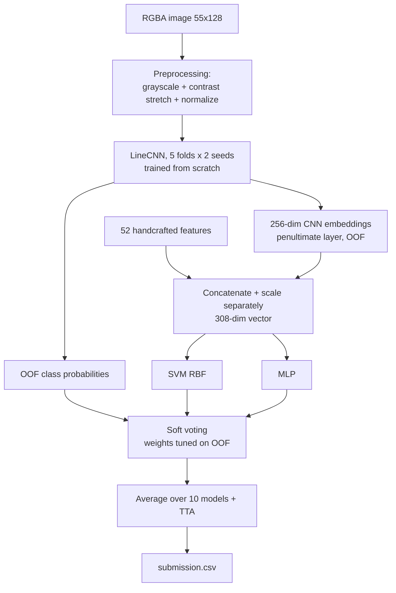
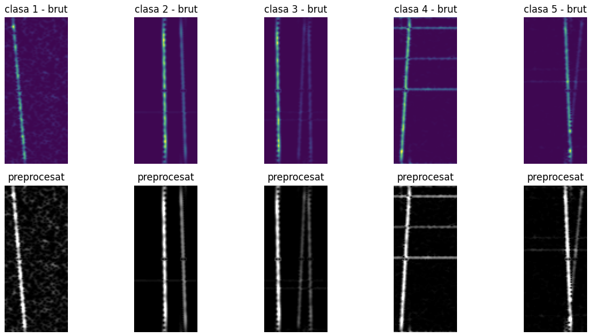
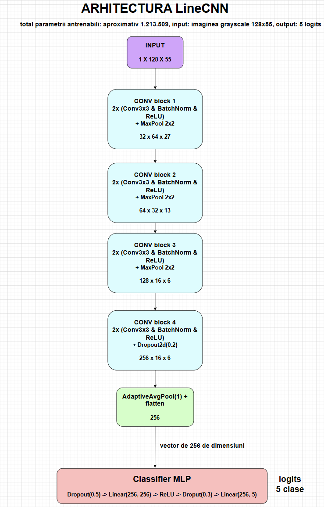
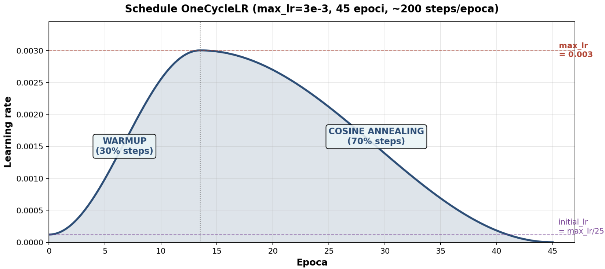
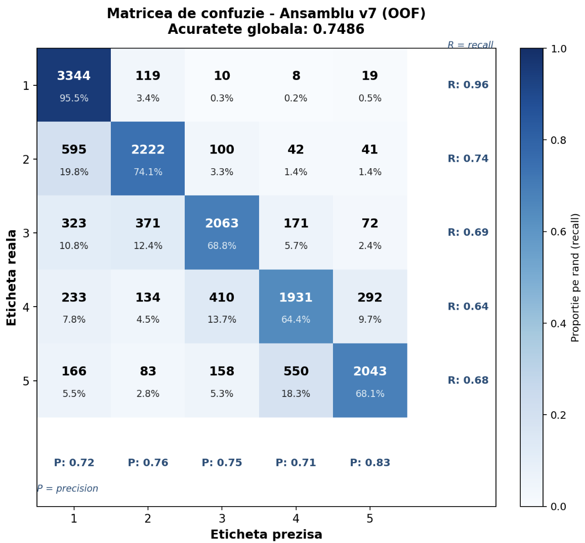

# Signal Object Detection — Counting Objects in Noisy Radio Signals

Counting the number of objects (1–5) in noisy radio-signal spectrograms, framed as a
5-class image classification problem. The final solution is a hybrid ensemble of a
from-scratch CNN, handcrafted signal features, and classical classifiers (SVM / MLP),
combined by soft voting with weights tuned on out-of-fold predictions.

**Final result: 0.78545 public / 0.77478 private accuracy** (Kaggle leaderboard).

> Kaggle competition for the *Artificial Intelligence / Machine Learning* course,
> Faculty of Mathematics and Computer Science, University of Bucharest.
> Full report (in Romanian): [`docs/Raport_Signal_Object_Detection.pdf`](docs/Raport_Signal_Object_Detection.pdf).
> Source code and in-code comments are in Romanian; this README explains everything in English.

---

## Highlights

- **Problem framing tested empirically.** Classification (CrossEntropy) clearly beat regression
  (MSE + rounding): **0.7229 vs 0.5535** OOF. With accuracy as the metric, regression's tolerance
  of small continuous errors is not rewarded.
- **Domain-specific preprocessing was the single biggest win.** Percentile contrast stretching +
  per-image normalization raised OOF accuracy from **~0.72 (v1) to 0.7449 (v3)** — larger than every
  later improvement combined.
- **`LineCNN` trained from scratch** — 4 convolutional blocks, ~**1.24M** trainable parameters,
  deliberately small to avoid overfitting on 55×128 images.
- **Leakage-free stacking.** Out-of-fold predictions (5 folds × 2 seeds = 10 CNNs) provide the
  features that the SVM/MLP stackers train on, so no stacker ever sees features from a model that
  memorized the sample.
- **Hybrid feature representation.** 256 learned CNN embeddings + 52 handcrafted geometric features
  (projections, peaks, Sobel, simplified HOG), scaled separately → a 308-dim vector.
- **Honest experiment log, including failures** — regression, a deeper CNN, Hough line counting,
  and Mixup are documented with the reason each one did not work.

---

## Problem

| | |
|---|---|
| **Task** | Count objects (thin lines) in noisy radio-signal spectrograms. Labels 1–5 = number of objects. |
| **Framing question** | Classification vs. regression — resolved empirically in favor of classification. |
| **Train set** | 15,500 labeled images |
| **Test set** | 5,500 images |
| **Native resolution** | 55 × 128, RGBA |
| **Class balance** | Class 1: 3,500 · Classes 2–5: 3,000 each (handled with balanced class weights) |
| **Metric** | Accuracy |
| **Leaderboard** | Public ≈ 25% of test (random), private ≈ 75% |
| **Submission** | CSV with header `id,label` (e.g. `000001.png,1`) |

The objects appear as thin (~1–2 px) lines: vertical (constant-frequency signals), diagonal
(chirps, with varying slope), and — at classes 3–5 — frequently overlapping or intersecting.

---

## Approach overview



The CNN is used twice: directly as a classifier (its probabilities enter the ensemble) and as a
feature extractor (its 256-dim penultimate activations feed the SVM/MLP).

---

## Data analysis & preprocessing

The images are spectrograms rendered with a violet–green colormap. Crucially, the RGB channels are
a deterministic colormap applied to a single scalar signal (spectral intensity), so **grayscale
conversion loses no useful information** and **color augmentation (ColorJitter) would destroy exactly
the signal that matters**.

Preprocessing (`preprocesare.py`) has three sequential steps:

1. **Grayscale by ITU-R 601 luminance** — `pil_img.convert('L')` (`L = 0.299R + 0.587G + 0.114B`).
   Reduces input dimensionality 3× with no information loss.
2. **Contrast stretching** — map the `[percentile 1, percentile 99]` range to `[0, 1]`, clipping
   outliers (rare noise, saturation) and sharpening faint lines. **This step alone moved OOF accuracy
   from ~0.72 to 0.7449** and was the most valuable single intervention in the project.
3. **Per-image normalization** — mean 0, std 1 per image, so the CNN does not latch onto absolute
   background intensity.



---

## Augmentation choices

Because this is a **counting** task, any transform that could change the number of objects would
corrupt the label. Only label-preserving transforms were used (`cnn.py`, train split only):

| Used | Why it is safe |
|---|---|
| Horizontal flip, p=0.5 (`torch.flip dims=[2]`) | Reverses the time axis; a positive-slope line becomes negative-slope but is still one line. |
| Small translation ±3 px (`torch.roll`) | Shifts lines inside the frame without removing or duplicating any; ±3 px keeps lines fully in-frame. |

| Avoided | Why |
|---|---|
| Vertical flip | The frequency axis is physically asymmetric (low vs. high frequencies behave differently). |
| RandomErasing | Could erase an object, silently turning a "3" into a visual "2" while the label stays wrong. |
| ColorJitter | Color encodes signal magnitude; altering it alters the object evidence. |
| Large rotations | Would distort line geometry away from the real test distribution. |

---

## Model: `LineCNN`

A task-specific CNN trained from scratch (no pretrained weights), `cnn.py`.



Each block is `2 × (Conv3×3 pad 1 → BatchNorm → ReLU)`. Blocks 1–3 end with MaxPool 2×2; block 4
uses `Dropout2d(0.2)` instead. `AdaptiveAvgPool2d(1)` yields a 256-vector (translation-invariant,
fixed size), followed by the MLP classifier.

| Stage | Output shape (C×H×W) |
|---|---|
| Input | 1 × 128 × 55 |
| Block 1 (32 ch) + MaxPool | 32 × 64 × 27 |
| Block 2 (64 ch) + MaxPool | 64 × 32 × 13 |
| Block 3 (128 ch) + MaxPool | 128 × 16 × 6 |
| Block 4 (256 ch) + Dropout2d(0.2) | 256 × 16 × 6 |
| AdaptiveAvgPool2d(1) + flatten | 256 |
| Classifier: Dropout(0.5) → Linear(256,256) → ReLU → Dropout(0.3) → Linear(256,5) | 5 logits |

**Trainable parameters: 1,240,677 (~1.24M)**, verified with
`sum(p.numel() for p in LineCNN(5).parameters() if p.requires_grad)`.
(The report's architecture figure states ~1.21M; the measured value is ~1.24M.)
The model is kept small on purpose — larger models overfit these tiny images.

### Training hyperparameters (`configurare.py`)

| Parameter | Value | Note |
|---|---|---|
| Batch size | 64 | |
| Max epochs | 45 | |
| Min epochs | 18 | floor before early stopping can trigger |
| Early-stopping patience | 13 | on validation accuracy |
| Optimizer | Adam | lr 1e-3, weight decay 1e-4 |
| LR schedule | OneCycleLR | max_lr 3e-3, 30% warmup (`pct_start` default), then cosine annealing |
| Loss | CrossEntropy | label smoothing 0.05 |
| Class weights | `balanced` | compensates class-1 imbalance |



---

## Validation strategy (OOF)

`StratifiedKFold(n_splits=5, shuffle=True, random_state=42)` is repeated over seeds `[42, 123]`,
for **10 CNNs total**. For every training image, the prediction used downstream comes from a model
that did **not** train on it. This out-of-fold discipline is what makes stacking safe: the SVM/MLP
stackers train on OOF CNN features and probabilities, so they never see features produced by a model
that memorized the sample.

- OOF probabilities and OOF 256-dim embeddings are averaged over the 2 seeds.
- Test prediction = average of all 10 models, with **TTA** = `(p(x) + p(flip(x))) / 2`.

---

## Handcrafted features

52 features from classical image processing (`features.py`), cached to `.npy`, in 6 families:

| Family | Features | Count | Motivation |
|---|---|---|---|
| A. Axis projections | mean/std/max/min over columns and over rows | 8 | total signal energy along the main directions |
| B. Peaks on projections | count, heights, inter-peak distance, at 3 prominence levels (0.05 / 0.10 / 0.25) | 14 | proxy for the number of distinct lines |
| C. Directional Sobel | horizontal/vertical gradient magnitude stats + ratio | 7 | edge (line-border) detection and dominant orientation |
| D. Orientation histogram | 8 bins over [0°,180°], magnitude-weighted, pixels above p75 | 8 | distribution of line orientations (simplified HOG) |
| E. Global statistics | mean, std, min, max + percentiles 25/50/75/90/95/99 | 10 | intensity distribution |
| F. Lit-pixel densities | fraction of pixels above percentiles 70/80/85/90/95 | 5 | how "crowded" the image is at various thresholds |

The three prominence levels in family B separate faint lines (0.05), standard lines (0.10), and
strong/clear lines (0.25).

**Why keep them if they're weak alone?** An SVM RBF ablation (3-fold CV on OOF features) reported
**manual-only 0.5006, CNN-only 0.7381, combined 0.7316**. The handcrafted features are weak on their
own and do not raise the SVM above CNN-only — but they add *diversity* to the ensemble, which is why
they were kept. *(Caveat: these ablation numbers are not pinned to specific SVM hyperparameters in
the code, and the combined value coincides with the `C=10` grid cell rather than the best `C=1`
result below, so treat them as indicative rather than a strictly controlled comparison.)*

---

## Classical models & ensemble

CNN embeddings (256) and handcrafted features (52) are each standardized separately, then
concatenated into a **308-dim** vector on which the classical models train.

**SVM RBF** — grid search over `C ∈ {1, 10, 100}`, `γ ∈ {scale, auto}`, 3-fold CV on OOF features:

| C | γ | CV accuracy |
|---|---|---|
| **1** | **scale** | **0.7437 (best)** |
| 1 | auto | 0.7436 |
| 10 | scale | 0.7316 |
| 10 | auto | 0.7317 |
| 100 | scale | 0.6866 |
| 100 | auto | 0.6866 |

`C=100` overfits clearly; `γ=scale` vs `auto` barely differ (robust to kernel width).

**MLP** (`MLPClassifier`, Adam, `max_iter=300`, early stopping) — grid over architecture and L2 `α`:

| Hidden layers | α | CV accuracy |
|---|---|---|
| (256,) | 1e-4 | 0.7152 |
| (256,) | 1e-3 | 0.7210 |
| **(512, 128)** | **1e-4** | **0.7268 (best)** |
| (512, 128) | 1e-3 | 0.7244 |
| (512, 256, 64) | 1e-3 | 0.7218 |

**KNN** (`weights='distance'`, `K ∈ {3,5,7,11,15,21,31}`) and **GaussianNB** are used in the pure
classical pipeline (`solutie_ineficienta.py`); KNN also joins the v8 ensemble.

**Ensemble** — soft voting with weights found by exhaustive grid search (step 0.05, weights summing
to 1) on OOF predictions:

| w(CNN) | w(SVM) | w(MLP) | OOF accuracy |
|---|---|---|---|
| 1.00 | 0.00 | 0.00 | 0.7470 |
| 0.70 | 0.30 | 0.00 | 0.7478 |
| 0.60 | 0.25 | 0.15 | 0.7481 |
| **0.55** | **0.30** | **0.15** | **0.7486 (best)** |
| 0.50 | 0.30 | 0.20 | 0.7484 |

---

## Results

| Version | Approach | OOF | Public | Private |
|---|---|---|---|---|
| v1 | Simple CNN, no specialized preprocessing | 0.7229 | 0.73963 | 0.73793 |
| v2 | CNN regression (MSE + rounding) | 0.5535 | 0.61236 | 0.58012 |
| v3 | CNN + line-aware preprocessing | 0.7449 | 0.78181 | 0.77066 |
| v4 | Deeper CNN (5th block 512 ch, 7×1/1×7 kernels, asymmetric pooling) | 0.7239 | 0.76581 | 0.75054 |
| v5 | Hough-based features — abandoned after preliminary tests | – | – | – |
| v6 | Pure classical pipeline (`solutie_ineficienta.py`) | not reported | not reported | not reported |
| **v7 (main)** | **CNN + handcrafted features + SVM/MLP, soft voting** | **0.7486** | **0.78545** | **0.77478** |
| v8 | v7 + 4 seeds + KNN in ensemble | 0.7493 | 0.78109 | 0.77284 |
| v9 | v7 + Mixup + Gaussian noise | 0.7348 | not uploaded | – |
| v10 | v7 + extended TTA (5 transforms) | 0.7480 | 0.78472 | 0.77042 |

The three submissions selected for the final leaderboard were **v7, v8, v10**.

A note on significance: 4–5 variants land in the narrow OOF band **0.745–0.749**, which is within
statistical noise for a single run. v8 has a slightly higher OOF (0.7493) than v7 but a lower public
score — differences under ~0.5% OOF should not be read as real improvements.

---

## Error analysis



Ensemble OOF accuracy **0.7486**. Per-class recall `0.96 / 0.74 / 0.69 / 0.64 / 0.68`, precision
`0.72 / 0.76 / 0.75 / 0.71 / 0.83` (rows = true class 1–5, columns = predicted).

Two consistent patterns (recomputed from the matrix):

1. **Most errors are between adjacent classes, but not exclusively.** ~**67%** of errors are off by
   one class and ~**33%** are off by ≥2 classes. Distinguishing 3 vs 4 objects is genuinely harder
   than 1 vs 5. (For true class 4, predictions of class 1 or 2 account for **~12%** of its samples —
   non-trivial, not negligible.)
2. **Systematic under-counting toward class 1.** Class 1 has recall 0.96 but precision only 0.72, so
   ~28% of class-1 predictions actually belong to classes 2–5. This bias toward the most populated
   class persists across all variants, which *suggests* a data-level ceiling — likely overlapping or
   faint lines that are inherently ambiguous — rather than a defect of any single method.

The per-model matrices (CNN 0.7470, SVM 0.7426, MLP 0.7268) show the same error structure; see
[`docs/figures/`](docs/figures/).

---

## What didn't work

- **Regression (v2).** MSE penalizes deviations but does not maximize the probability of the correct
  class, so it is a poor fit for an accuracy metric (0.5535 OOF vs 0.7229 for classification).
- **Deeper CNN with oriented convolutions (v4).** An extra 512-channel block and 7×1 / 1×7 kernels
  added capacity that overfit the small images; the oriented kernels did not compensate.
- **Hough line counting (v5).** Noise fragments real lines into many short segments (9–37 segments
  for a single real line), so raw segment counting failed. Abandoned after tests on a few images,
  before a complete implementation.
- **Mixup + Gaussian noise (v9).** A soft label like "(0.5 class 2) + (0.5 class 4)" has no physical
  meaning in a counting task (2.5 objects is not a valid image), so it hurt generalization
  (0.7348 OOF). A good regularizer does not transfer blindly across task types.

---

## Key takeaways

- **Domain-specific preprocessing can beat model capacity.** The contrast-stretch step contributed
  more (~2% OOF) than all architectural and ensembling work combined.
- **Regularization techniques don't transfer blindly.** Mixup helps ordinary classification but is
  harmful for counting, where interpolated labels are meaningless.
- **OOF discipline is what makes stacking honest.** Training stackers on in-fold CNN features would
  leak memorized information and inflate validation scores.
- **Ensemble diversity > individual precision.** Weak handcrafted features still improved the ensemble.

---

## Possible improvements (untested ideas)

- **Ordinal regression (e.g. CORAL/CORN)** to exploit label order while keeping a classification-style
  objective.
- **Threshold / bias correction** against the systematic over-prediction of class 1.
- **Pseudo-labeling** on confident test predictions.
- **Time-axis attention** or anisotropic architectures better matched to line geometry.

---

## Repository structure

```
.
├── configurare.py          # Constants, paths, and CNN hyperparameters
├── preprocesare.py         # preprocesare(): the 3-step image preprocessing
├── features.py             # extrag_trasaturi_manuale(): 52 handcrafted features (+ .npy cache)
├── cnn.py                  # SignalDataset, LineCNN, train_pe_fold(), infereaza(), infereaza_tta_extinsa()
├── main.py                 # v7 pipeline — the main solution
├── main_versiunea8.py      # v8 — 4 seeds + KNN added to the ensemble
├── main_versiunea10.py     # v10 — extended 5-transform TTA
├── solutie_ineficienta.py  # Pure classical baseline (NB, KNN, SVM, MLP on handcrafted features)
├── requirements.txt
└── docs/
    ├── Raport_Signal_Object_Detection.pdf   # Full report (Romanian)
    └── figures/                             # Figures extracted from the report
```

File/function names are kept in Romanian to match the code. English glosses:
`configurare` = configuration, `preprocesare` = preprocessing, `features` = features,
`train_pe_fold` = train one fold, `infereaza` = infer, `infereaza_tta_extinsa` = extended-TTA infer,
`solutie_ineficienta` = inefficient (baseline) solution.

---

## How to run

**1. Install dependencies** (Python 3.10+; a CUDA-capable GPU is strongly recommended — training 10
CNNs on CPU is very slow):

```bash
pip install -r requirements.txt
```

**2. Place the Kaggle data** in a `./data/` folder (paths are set in `configurare.py`):

```
data/
├── train.csv        # columns: id,label   (e.g. 000001.png,1)
├── test.csv         # column:  id
├── train/           # 15,500 training images
└── test/            # 5,500 test images
```

**3. Run a pipeline.** Each script creates `./output/` and writes model checkpoints
(`m_s{seed}_f{fold}.pth`), cached features (`*.npy`), and submission CSVs.

```bash
python main.py                 # v7 (main)  -> output/submission_ensemble.csv
python main_versiunea8.py      # v8         -> output/submission_v8_ensemble.csv
python main_versiunea10.py     # v10        -> output/submission_v10_ensemble.csv
python solutie_ineficienta.py  # classical baseline -> output/submission_clasic_*.csv
```

Each CNN pipeline prints the OOF CNN accuracy, the SVM/MLP grid searches, the chosen ensemble
weights, the OOF confusion matrices, and a classification report. Submission CSVs use the required
`id,label` header.

---

## Tech stack

Python · PyTorch · scikit-learn · SciPy · NumPy · Pillow (exactly the imported dependencies).

---

## Context / Author

Project for the *Artificial Intelligence / Machine Learning* course, Faculty of Mathematics and
Computer Science, University of Bucharest.

- **Author:** Drăgunoi Miruna

